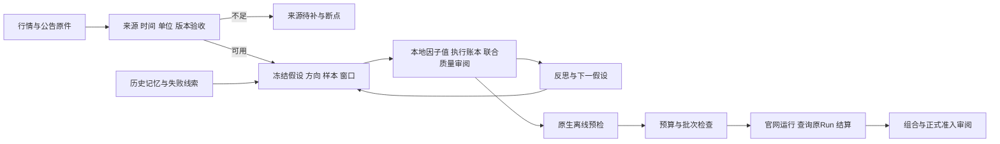

# QUANTAXIS 2.1.0-alpha2 · Panda Alpha 研究 Fork

基于 [QUANTAXIS](https://github.com/yutiansut/QUANTAXIS) 的数据与回测基础，为 PandaAI 因子研究增加来源验收、历史记忆、去相关、轨迹反思、收益归因和官网实验管理。

本 Fork 的目标是提高**可解释、可复现、扣除交易损耗后仍有效的因子质量**。研究同时考察净收益、阶段稳定性、回撤、行业与市场暴露、交易约束及组合增量；积分用于官网验收。

本说明对应包含 `panda_alpha/` 的研究版本。上游框架版本与新增研究层版本分别管理；研究层目前为 `0.1.0`，推荐使用 Python 3.11。原版说明保存在 [README_UPSTREAM.md](README_UPSTREAM.md)，详细配置和研究记录见 [RESEARCH.md](RESEARCH.md)。

研究文件采用[精简保留流程](docs/research_storage.md)：共享一份数据，每轮保存定义、净值与指标、继续或淘汰原因。`evaluate` 默认精简输出，逐证券执行明细按需启用。完整公开财报 PDF 可在保留文本、字段证据、来源网址和哈希后释放缓存，重新解析时按需恢复。

## 在原项目基础上做了什么

### 1. 用 AXIS 兼容数据层组织研究来源

新增 [`AxisProvider`](panda_alpha/data.py)，统一读取 QUANTAXIS 兼容 MongoDB 中的行情、复权、日历、身份和已认证财务版本，输出覆盖证据。

- 原始价、复权价、成交量单位、交易日历和历史证券身份分别验收。
- 沪深、北交所、退市身份及来源中断采用独立状态和断点。
- StockDB 经来源契约、独立价格/成交单位对照和逐行验收后，作为本机日线研究主渠道；BaoStock 保留已取得行情和日历/身份资料作对照，AKShare 与 TDX 用于明确补缺或独立对照。各价格渠道隔离存储，研究不自动混源。
- 旧数据可归档到独立历史库，保留文件哈希、原值和迁移游标。
- `can_retire_legacy` 由数据能力验收决定。完整市场、复权或需要的财务/分钟能力未通过时，继续保留旧原始证据。

“切换到 AXIS”是统一存储、查询和验收，数据供应商的可用性仍需单独解决。

2026-10-08 新增 [`sources.py`](panda_alpha/sources.py) 和 [统一渠道操作说明](docs/data_sources.md)：一个配置登记各渠道职责及默认行情，`data-status` 查看真实库存，`data-sync` 按月采集并保存断点，`data-export` 准备来源和哈希绑定的研究输入。行情库与日历、身份、行业、财报所在的资料库可以分开。`coverage`、`evaluate` 和工程研究入口共用来源解析。

同码多来源价格在去重前检查，复权凭证按所选来源和完整窗口匹配；缺少所选来源时保持缺失。StockDB 使用终点以前的同源累计因子，前复权在研究终点重定基准。来源契约与局部可用数据不等同于完整全市场或财报 PIT 验收。

### 2. 增加原文披露与当时可见数据检查

[`financial.py`](panda_alpha/financial.py)、[`industry.py`](panda_alpha/industry.py) 及专用财报模块支持在决策时点选择已公开的来源版本。

财报金额解析现共用严格文本检查及原始 PDF 表格恢复：拆行小数、金额粘连、附注括号、空白列与续页合并单元格均有回归验证。恢复先核对原件哈希、合并报表边界、期间和单位；证据不足保留待核。详见[财报解析说明](docs/statement_parsing.md)。

- 区分报告期、公告日、首次可用日和修订版本；只有日期的公告保守地从次日可用。
- 合并报表、母公司报表、当前金额、比较金额、人民币单位和原文页分别记录证据。
- 最新已公开报告尚未解析、修订范围不明或比较口径无法闭合时，返回未知状态。
- 空白、横杠和没有找到字段不直接填零；零值需要明确打印值或经过证明的会计关系。
- 财务最新重述快照与原始公开版本隔离，防止把今天的数值回填到过去。
- 行业分类按公开版本和实际发布日期查询，当前分类不自动回填历史。

目前已实现现金短债缓冲、毛盈利、年度贸易营运资本投资、经营规模调整的营运资本效率、业绩公告和回购等专用来源模块。[`trade_accrual.py`](panda_alpha/trade_accrual.py) 从同一年度合并报表读取应收、存货、应付及资产的期末与期初余额；[`trade_efficiency.py`](panda_alpha/trade_efficiency.py) 增加同年报两年度营业收入流量；[`component_efficiency.py`](panda_alpha/component_efficiency.py) 进一步以收入参照应收、以营业成本参照存货和应付，核验合并利润表的原文边界及成本更正依赖。它们验证的是**所提供原件和版本范围**，全市场完整修订历史仍需补齐。

### 3. 从重复公式搜索改为有轨迹的假设研究

[`evolution.py`](panda_alpha/evolution.py) 记录信息机制、字段需求、方向、父候选、证伪方案和反思轨迹；支持变异、跨机制交叉和显式 LLM 后端。

[`diversity.py`](panda_alpha/diversity.py) 同时检查 AST/参数族重复、机制与字段多样性，并使用同股票、同日期的实际因子值计算每日 Spearman 相关。

来源缺失、执行失败、相关性过高、成本问题与经济证伪分别处理。**同族连续来源缺失不会耗尽经济调查次数，也不会因此自动放弃该族。** 旧状态的修复保留迁移证据。

默认关闭 LLM 请求。离线候选生成使用有限模板和历史种子；启用 LLM 需要显式配置模型、调用后端与环境变量，生成结果仍是待验证假设。

### 4. 加入持仓账本、收益归因和组合验证

- [`evaluation.py`](panda_alpha/evaluation.py)：受限公式解释器、下一交易日开盘的本地代理评估、成本与收益统计。
- [`execution.py`](panda_alpha/execution.py)：执行证据与订单状态。
- [`attribution.py`](panda_alpha/attribution.py)：现金、持仓数量、价格损益、费用和净值勾稽。
- [`portfolio.py`](panda_alpha/portfolio.py)：固定组合政策、对照与增量研究。
- [`admission.py`](panda_alpha/admission.py)：来源、历史股票池、执行、稳定性、实际去相关、组合增量及官网证据的正式准入检查。

新入池审查使用 [pool-admission.v1.json](config/pool-admission.v1.json)，沿用 `admission` 命令。从哈希绑定的完整池日账本重算30/50bp净收益、Sharpe及逐月A+C代理，检查每个生效过渡状态至少5个因子。缺源、版本不符、B冷启动及未完成影子验证保持待核；历史代理通过不表示官网积分已提高。证据接口和使用方式见 [入池门槛](docs/pool_admission.md)。

实际研究已使用单边 30/50bp、同支持范围的基准、分阶段表现、行业/Beta 暴露、贡献集中度及固定初始资本组合对照。低 IC、低换手或低因子相关性均不能单独替代质量判断。

通用 CLI 的价量公式评估已接入公共 [`study.py`](panda_alpha/study.py) 的 `prepare → validate → evaluate`，产出两档成本、所有组、共同市场、阶段、贡献与持仓账本。提供明确的 `--benchmark-id` 和实际池面板时，还会核算同支持固定半初始资本组合。原文财报及事件模块可将自己的 PIT 日值接到同一公共接口，详见 [公共工作流](docs/panda_alpha_workflow.md)。复杂 Python 的官网执行仍须原生预检。

[`quality.py`](panda_alpha/quality.py) 将来源、潜在执行、经济与组合证据分别形成反馈。未知原始价、交易状态、风险元数据或部分形成日不足会保持相应待核状态；正式准入仍是独立审核。

### 5. 官网运行前先在本地排除已知失败

[`native_preflight.py`](panda_alpha/native_preflight.py) 重放已知的 PandaAI 日期/证券索引、字段包装、输出顺序、有效覆盖及分组条件，绑定源码、方向、窗口、来源和接口证据。新的原生 Python 候选必须通过对应预检。

[`platform.py`](panda_alpha/platform.py) 和工作进程保存预算预留、Factor ID、Run ID、日志与结算：

- 来源诊断、探索和验证使用不同预算类别，当前串行派发。
- 赠送优先；充值及估算计费需满足对应批次授权。
- 模糊派发不自动重试；恢复时查询原 Run ID，避免重复收费。
- CLI 的轮询超时不等于取消服务端任务。
- 平台未提供单次硬扣费上限时，预算估计不能当作账单保证；默认配置保留阻断。

账号凭据由用户自己的官方 CLI 配置管理，不写入本仓库。

### 6. 历史 compact 保留证据与失败线索

[`memory.py`](panda_alpha/memory.py) 将历史研究整理为热记忆、冷证据索引、来源哈希和池快照，原始结果继续保留。

[`registry.py`](panda_alpha/registry.py) 统一旧 CLI 试验和专项协议，使用不可变事件及哈希链记录唯一策略、来源/执行修复、经济结论与人工淘汰。同一定义、方向、窗口、调仓及分组只计一次，费用档和适配修复不新增策略。历史基数保留415；首次迁移累计449，WC01、WC02各新增一次后为451，固定WC02的新发行人验证上下文为452，再登记按科目参照经营规模的WC03，累计 **453**。WC03的600家公司由两个已暴露样本合并，不能冒称新盲样本。同支持的旧策略对照不额外计数。实时累计由登记库导出，不会将累计数当作新基数再加一遍。

登记迁移先生成可审核计划，哈希或累计身份未对齐时拒绝应用。热记忆由事实导出，人工淘汰不能被改名、后代候选、LLM或来源扩展绕过；只有明确人工重开能解除。固定经济失败仅约束相应定义和窗口，来源待补单独保存。

## 研究流程



公共运行器已统一准备、校验和记账；因子接入保留各自来源逻辑。**来源待补、执行修复、经济不通过和正式入池是不同状态。**

## 快速开始：研究层

取得包含 `panda_alpha/` 的研究分支或发布版本后，在仓库根目录执行。行情库、账号、大型原始报告及私有研究结果需要自行配置，克隆仓库不会下载这些数据。

### 1. 创建独立环境

```powershell
py -3.11 -m venv .venv
.\.venv\Scripts\python.exe -m pip install -r requirements-panda-alpha.txt
.\.venv\Scripts\python.exe -m panda_alpha --help
```

研究入口可直接从源码目录运行，不要求安装上游完整交易、Web 和 Rust 依赖。Linux/macOS 使用 Python 3.11 创建环境后，将下文解释器替换为 `.venv/bin/python`。

### 2. 首次创建私有配置

```powershell
# 已有配置时保留原文件
Copy-Item config/panda-alpha.example.json config/panda-alpha.local.json
$Python = ".\.venv\Scripts\python.exe"
$Config = "config/panda-alpha.local.json"
```

按实际环境设置 MongoDB、数据语义、研究日期、封存窗口、历史记忆、候选池及官网预算。示例配置是起始模板；已有研究必须与当前封存窗口和累计登记核对，不能覆盖个人状态。全局 `--config` 和 `--trial-ledger` 参数放在子命令之前。

### 3. 离线生成待验证候选

```powershell
& $Python -m panda_alpha --config $Config plan `
  --count 4 `
  --state research_runs/evolution_state.json `
  --output research_runs/generation01.json
```

默认 `llm.enabled=false` 时此命令不访问官网或 LLM。它生成计划，不证明字段、方向、独立性或收益已经合格。

### 4. 配置数据并检查覆盖

已有 MongoDB 可直接设置 `data.mongo_uri`。Windows 本地部署入口为：

```powershell
.\scripts\setup_axis.ps1 -Python $Python -Start
```

来源同步、独立补充渠道、断点恢复和迁移验收命令见 [RESEARCH.md](RESEARCH.md)。AKShare 补充入口需要单独的 [依赖文件](requirements-panda-alpha-akshare.txt)。

以下用两个证券检查取数入口；这不代表全市场验收或有效因子样本：

```powershell
& $Python -m panda_alpha --config $Config coverage `
  --codes 000001 600000 --start 2025-01-02 --end 2025-12-31 `
  --raw --output research_runs/axis_raw_acceptance.json
```

`--raw` 只诊断原始来源；去掉它才按配置检查复权资料。空库、来源中断或未认证信息可能返回待补状态。

### 5. 本地公式评估与反思

先把已验收的六位证券代码逐行写入 `research_runs/validated_codes.txt`。默认至少需要 30 只股票；完整研究还应按实际覆盖和暖机需要确定样本与窗口。`pool_values` 应保存已有池成员的实际 `.csv.gz` 日期×证券因子面板。

```powershell
$Codes = Get-Content research_runs/validated_codes.txt
& $Python -m panda_alpha --config $Config evaluate `
  --candidates research_runs/generation01.json --codes $Codes `
  --start 2025-01-02 --end 2025-12-31 `
  --pool-values research_runs/pool_values --benchmark-id F141 `
  --output research_runs/local_review

& $Python -m panda_alpha --config $Config evolve `
  --parents research_runs/generation01.json `
  --evidence research_runs/local_review/feedback.json `
  --count 4 --state research_runs/local_review/evolution_state.json `
  --output research_runs/generation02.json
```

`F141` 是示例基准 ID，须替换为实际池中具有方向证据和面板的 ID；没有基准时可省略 `--benchmark-id`，组合增量保持待核。需要更早行情暖机时使用 `--warmup-start`，该范围也接受封存窗口检查。专用财报或事件因子使用公共 `study` 接口传入明确的 PIT 日值，不在价量解释器中伪装成最新财务快照。

### 6. 官网计划、预览和恢复

```powershell
& $Python -m panda_alpha --config $Config schedule `
  --candidates research_runs/generation01.json

# 先从 generation01.json 选择真实候选ID
$CandidateId = "填写已验证的候选ID"
& $Python -m panda_alpha --config $Config dispatch `
  --candidates research_runs/generation01.json --candidate-id $CandidateId `
  --category exploration --start 2025-01-02 --end 2025-12-31
```

`schedule` 和不带 `--execute` 的 `dispatch` 会联网读取账号余额，但不启动回测。实际派发需另外满足预检、来源和预算授权条件；批次授权与指纹格式见 [RESEARCH.md](RESEARCH.md)。

已派发任务使用保存的真实指纹恢复查询：

```powershell
$Fingerprint = "填写已保存的真实指纹"
& $Python -m panda_alpha --config $Config resume `
  --fingerprint $Fingerprint --ledger research_runs/experiments.sqlite3 `
  --output research_runs/official_results
```

## 当前验收状态

截至 2026-10-08，本机研究版本具备上述来源、反思、账本与官网管理能力。后续补数将原件获取清单扩展至 5252 个代码的并集；固定 18096 个追加任务已全部遍历，18095 份 PDF 与全文就绪，1 个旧公告 ID 原件缺口保留断点。该代码并集是采集清单，完整历史可交易股票池仍待认证；大体积原件及私有研究记录不随仓库分发。

整合三批来源后，8922 个年报版本具备应收、存货、应付、总资产、营业收入及营业成本的本期和比较期金额证据。在 2025-08-14 至 2026-09-03 的 257 个交易日中，798583 条代码日记录通过所列版本内的来源门槛，单日中位数3066家。这里尚未检查行情支持、交易可用性或因子收益，不能作为完整 PIT 或官网全 A 认证。

现金短债缓冲和年度毛盈利两个固定定义经联合审阅未获入池，半年报 TTM 版本保持来源待补。WC03在同支持600股研究中，单边50bp费用后净收益12.67%，略低于WC02的12.94%，最大回撤从24.10%降至22.17%；它保留为风险与组合改善线索，尚未入池。市场关联、集中贡献及阶段不稳定仍需验证。原F141保留，近期这一轮官网消费为零。数据验收、运行成功与发现有效Alpha分别记录，研究过程和限制见 [RESEARCH.md](RESEARCH.md)。

后续补数发现旧600家还有1062条已知修订公告未进入原正文审阅子集，这批原件已全部补齐。整合5902条已知更正候选后，3309条仍存在更正范围或受影响字段屏障；另有1633个年报版本的字段证据、365个原版报告元数据单元待核，元数据未定位不能直接认定报告不存在。上述收益仍是旧子集下的探索记录，未按当前来源重算；所有旧结果与来源字节保留。官网CLI固定沪深全A，当前采集并集及局部样本均不能替代官网实际输入池和字段契约验收。

仍待完善：完整历史全 A 身份与行情、北交所历史复权、分钟资料、财务全部字段及季度修订链、真实竞价/容量和新的独立样本验证。当前 `can_retire_legacy=false`，尚不适合删除唯一旧数据来源。

## 本轮工作流优化（2026-10-07）

已完成：

1. **统一试验登记与约束。** 旧记录、专项协议、人工淘汰和固定失败接入同一事件事实来源；真实历史已对齐 449。新标签计算和官网派发前执行约束检查；官网策略在实际派发前登记。
2. **统一实验运行模块。** 不同因子共用独立日历、真实值分位分组、持续数量/现金/费用账本、市场与显式组合对照。公共小样本使用不同候选名称贯穿全流程，覆盖原移植变量遗漏。
3. **标准化财报字段。** 共享金额、单位、存量/流量期间、披露日及精度接口；schema2直接携带比较期，保留schema1和历史sidecar兼容。季度与九个月流量不能误作H1。
4. **接入联合质量反馈。** CLI保留两费档、阶段、集中度、潜在执行和组合增量，源不足不作经济否决，实际竞价与正式入池证据独立验收。
5. **完善公共复现。** 包装脚本优先选repo虚拟环境或PATH Python，CI采用同一依赖入口，公共契约可纳入Git；干净源码复制和合成数据检查不依赖个人数据库。

后续数据完整性、真实成交、独立样本和新的因子研究，仍按各自证据状态推进；工作流优化不等于已发现新Alpha。

## 目录与验证

- [`panda_alpha/`](panda_alpha/)：研究层、来源接口、状态、去相关、账本与官网管理。
- [`scripts/`](scripts/)：部署、采集、迁移和验收入口。
- [`config/panda-alpha.example.json`](config/panda-alpha.example.json)：可公开的配置模板。
- [`research_bootstrap/`](research_bootstrap/)：可公开的初始 compact 与验收摘要。
- `research_runs/`：本地协议、原件、状态和结果，Git 忽略。
- [`tests/`](tests/)：离线回归测试及公开合成数据。
- [`docs/panda_alpha_workflow.md`](docs/panda_alpha_workflow.md)：登记、字段契约、公共运行器和复现接口。
- [`docker/panda-alpha/README.md`](docker/panda-alpha/README.md)：独立研究镜像的构建与验证说明。

```powershell
& $Python -m pytest tests -q
```

本机当前代码的离线测试与公共复现结果见 [优化验收记录](docs/panda_alpha_workflow.md#验证)。测试不调用真实官网回测，不证明实时外部数据源可用，也不替代股票池、修订历史和真实成交验收。

## 上游与方法来源

- [QUANTAXIS](https://github.com/yutiansut/QUANTAXIS)：基础 schemas、来源接口、复权及量化框架；原版权与功能说明保留。
- [QuantaAlpha](https://github.com/QuantaAlpha/QuantaAlpha)：多样化规划、轨迹进化与反思方法参考。
- PandaAI：通过用户安装的官方 CLI 进行原生验证、运行查询和结算。

上游研究结果与性能基准归属于对应项目。本 Fork 的能力与结果以自己的代码、测试和来源证据为准。许可证见 [LICENSE](LICENSE)。
