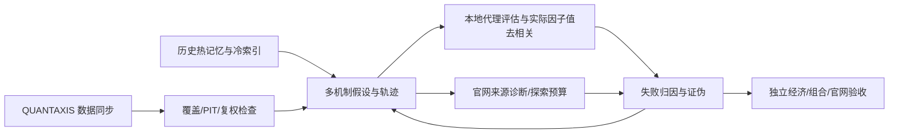

# Panda Alpha：AXIS 数据与轨迹进化研究

这个 Fork 新增 `panda_alpha`，将 PandaAI 研究的默认数据源改为 QUANTAXIS 兼容数据库，统一管理历史记忆、数值去相关、反思进化和官网实验预算。它使用独立的轻量依赖，不要求先部署上游交易、Web 或 Rust 服务。



## 已实现的研究变化

- AST 规范化和参数族去重；机制、字段、算子多样化选拔；使用同日期、同股票的实际因子值计算每日绝对 Spearman 相关。常量、稀疏覆盖、缺少池成员因子值时保留 pending。不能用 IC、收益摘要或名字不同代替独立性。
- 候选记录假设、信息机制、字段需求、公式或多步 Python 代码、冻结方向、父轨迹、证伪方案和反思。进化支持跨机制交叉及显式 LLM 后端。源缺口、执行错误、相关性、成本失败和机制证伪分别处理。修复数据源后可凭哈希绑定的新证据与证伪方案重开原机制。
- 官网来源诊断、探索和正式验证分别分配预算。最终入池门槛不阻挡探索。余额、派发前预留、Factor ID、Run ID 和结算写入 SQLite；中断后只查询原 Run ID，模糊派发不自动重试。当前默认串行执行。
- 本地代理严格使用决策后下一交易日开盘成交、单边 30/50bp 成本及固定五日调仓。无法构造完整交易日历、持仓缺退出价格或原始未复权价格时不出收益标签。实际涨跌停、停牌、容量、退市和官网组合验收仍须独立核验。
- 历史累计检验分母保留 415；新尝试跨批累计，相同定义/方向/窗口的两档成本不重复计数。封存窗口检查覆盖 warmup、外部反馈和已有进化状态。

## Windows 首次配置

```powershell
# 在 Fork 根目录执行。按实际环境替换 Python 路径。
.\scripts\setup_axis.ps1 -Python 'D:\Anaconda\envs\open-webui\python.exe' -InstallDependencies -Start
Copy-Item config\panda-alpha.example.json config\panda-alpha.local.json
```

数据库仅监听 `127.0.0.1:27018`，文件位于 `.runtime/mongodb`，下载校验官方 SHA256，不注册系统服务。`.runtime`、个人配置、账号状态、实验原始结果与 SQLite 账本均被 Git 忽略。已有数据库可直接修改 `data.mongo_uri`，不重复启动。

现有 PandaAI CLI 可直接配置 `platform.cli_command`。为支持分离派发与查询及 Windows UTF-8，推荐在私有配置中设置工作 Python 和官方 CLI 的 `site_packages` 路径。账号凭据仍由官方 CLI 从用户自己的配置读取，不复制到 Fork。

```powershell
.\scripts\Invoke-PandaResearch.ps1 account
.\scripts\Invoke-PandaResearch.ps1 plan --count 10 --output research_runs\generation01.json
.\scripts\Invoke-PandaResearch.ps1 schedule --candidates research_runs\generation01.json
```

规划不扣官网算力。离线初始生成器提供历史有用方向与有限的跨机制候选，用于验证管线；它没有无限自主创新能力。自主多步研究使用 `ResearchEngine` 的 `PlanningBackend.complete_json(stage, context)` 接口。`OpenAICompatibleBackend` 接收显式 caller；CLI 的 `llm.enabled=true` 需要配置模型和 `PANDA_ALPHA_LLM_KEY` 等环境变量。密钥不写进配置或历史记忆。当前配置默认禁用付费 LLM 请求。

## AXIS 来源与验收

`scripts/axis_sync.py` 同步 QUANTAXIS 的 Mongo schemas。TDX 旧节点可能返回名单/除权数据而不给 K 线，所以节点验收必须实际查询日 K 线。`scripts/probe_axis_nodes.py` 和 `probe_axis_protocol.py` 是免费、只读诊断工具。

同步任务区分 `stock_day`、`stock_xdxr`、`stock_list` 和 `calendar`。股票样本同步、当前沪深列表、完整历史 A 股、退市股票、分钟数据与财务公告 PIT 是不同的证据层级。复权需要成功来源凭证，不能因为数据库有几行数据就标完整。

本机已启动数据库并验证真实来源：60 只股票、2026-01-05 至 2026-09-18、174 个独立核验交易日，取得 10,432 条可交易行情；另有 8 条来源明确标记的停牌记录，保留排除原因，没有补零。3 只股票的前后复权价格与 BaoStock 官方接口逐日对照通过。6 个新候选完成本地代理评估并形成下一代 10 个研究候选；历史定义仍等待重新验证，实际池因子值、历史股票池和成交约束验收仍为 pending。本次未发起官网付费回测或 LLM 请求。脱敏验收记录见 [`deployment_validation.json`](research_bootstrap/deployment_validation.json)。

```powershell
$env:PYTHONPATH = "$PWD\.runtime\python"
python scripts\axis_sync.py --source baostock --codes 000001 600000 600519 --start 2021-09-20 --end 2026-09-18 --uri mongodb://127.0.0.1:27018 --report research_runs\axis_sample_sync.json
.\scripts\Invoke-PandaResearch.ps1 coverage --codes 000001 600000 600519 --start 2021-09-20 --end 2026-09-18
```

`coverage` 输出逐能力阻塞项和 `can_retire_legacy`。新包没有 StockDB/AKShare fallback。只有对应覆盖、复权、历史股票池及需要的财务/分钟能力通过后，才可归档并删除原渠道；未验收时保留旧原始证据，不能把渠道换名当作缺失问题已解决。

BaoStock 通过 QUANTAXIS 已支持的来源接口进入同一 schema。日行情保存原始价格，成交量从 shares 转换为 QA 的手数并保留 shares，成交额为人民币元。累计复权因子与交易日历独立保存。当前列表同步不能替代历史包含退市股票的股票池。

## 本地研究与反思

```powershell
.\scripts\Invoke-PandaResearch.ps1 evaluate --candidates research_runs\generation01.json --codes 000001 600000 600519 --start 2026-06-18 --end 2026-09-18 --output research_runs\local_review
.\scripts\Invoke-PandaResearch.ps1 evolve --parents research_runs\generation01.json --evidence research_runs\local_review\feedback.json --count 10 --output research_runs\generation02.json
```

三个股票只适合来源冒烟测试，不能通过默认至少 30 股票的统计/去相关门槛。正式研究应给完整可交易股票池和已登记池的 `--pool-values`。缺官方池因子值时，数值独立性保持 pending。

本地公式解释器仅支持受限的已知算子，不执行任意生成 Python。复杂 Python 因子在平台沙箱测试。历史 F141/F174/F253 等原公式可能包含旧私有算子；只有字段映射、方向、PIT 和官网语义核验通过，才能成为可执行新定义。

## 官网预算边界

用户选择：优先使用当天赠送算力，充值算力每批确认。默认 `daily_credit_limit=10`、`recharge_credit_limit=0`。`planning_credit_estimate` 仅安排队列，不能保证账单。

已核对 CLI 0.1.7：未提供 gift-only 硬隔离或单次最大账单参数，`--timeout` 仅结束客户端轮询。`server_enforced_cap=false` 时默认不启动可能跨入充值余额的任务；需要当前定价/限额证据或针对具体批次的估计计费风险授权。不能把历史 2/4/6 算力收费伪装成硬上限。

```powershell
# 先查看具体定义、窗口、类别和预算；默认不派发。
.\scripts\Invoke-PandaResearch.ps1 dispatch --candidates research_runs\generation01.json --candidate-id F-EXAMPLE --category exploration --start 2026-06-18 --end 2026-09-18
# 加 --execute 才会执行，并仍检查当前预算授权。
.\scripts\Invoke-PandaResearch.ps1 resume --fingerprint EXACT_SAVED_FINGERPRINT
```

预览输出包含精确 `fingerprint`，绑定公式/Python 定义、方向、日期窗口、调仓周期和分组数。每批先向用户展示这些定义、指纹和额度；用户明确确认后，才在私有 `compute` 配置中填入当日授权。例如下面的指纹与日期都应替换为已确认批次的实际值：

```json
{
  "recharge_credit_limit": 5,
  "recharge_batch_authorization": {
    "day": "YYYY-MM-DD",
    "batch_id": "confirmed-batch-01",
    "fingerprints": ["EXACT_FINGERPRINT_FROM_PREVIEW"],
    "max_recharge_credits": 5
  },
  "allow_estimated_billing": true,
  "estimated_billing_batch_authorization": {
    "day": "YYYY-MM-DD",
    "batch_id": "confirmed-batch-01",
    "fingerprints": ["EXACT_FINGERPRINT_FROM_PREVIEW"],
    "max_total_credits": 10,
    "accept_estimated_charge_risk": true
  }
}
```

充值授权额度须覆盖配置的 `recharge_credit_limit`；估计计费风险额度须覆盖 `daily_credit_limit`。二者同时启用时须使用同一批次 ID，每个新任务都必须属于对应指纹清单。修改定义或窗口后需要重新确认，过期授权和单独的 `allow_estimated_billing=true` 都不能派发。风险授权表达用户接受估计账单的范围，不能替代平台硬限额；默认充值额度仍为 0，估计计费仍关闭。

延迟结算、跨午夜、扣充值余额或超出预留金额会保持账本锁定，防止追加消费。零收费失败和其他模糊账单可用 `platform.settle_receipt` 附匹配 Run ID、核验人和真实账单文件哈希核销。余额差只作为串行观察，不能替代官方流水。

## 历史 compact

- `research_bootstrap/memory.json`：约 98 KB 热记忆，重点方向、冻结方向证据与失败规则。
- `memory.md`：人类可读摘要。
- `evidence.jsonl`：4,843 条去重因子证据，另有 34 条来源阻塞，按 evidence ID 检索。
- `source_index.jsonl`：967 个来源的相对路径及 SHA256。
- `pool.json`：脱敏历史池参考，当前实际生效池及后续替换仍须官网核对。

```powershell
python -m panda_alpha compact --workspace D:\PandaAI-Alpha --output research_bootstrap
python -m pytest tests -q
```

原约 10 GB 研究数据留在私人工作目录；compact 压缩的是常用研究上下文，保留来源追溯，未丢弃原始数据。旧门槛失败、来源失败、执行失败、官网验证与代理回测分开记录，不能把它们全部变成永久机制黑名单。

## 上游与方法来源

规划、变异、跨方向交叉和轨迹反思参考 [QuantaAlpha](https://github.com/QuantaAlpha/QuantaAlpha)。其 [runner](https://github.com/QuantaAlpha/QuantaAlpha/blob/main/quantaalpha/factors/runner.py) 的部分数值去相关被关闭，因此本 Fork 独立实现因子值去相关。上游实验收益不是本 Fork 的效果证明。

数据 schemas、除权公式及来源接口核对 [QUANTAXIS](https://github.com/yutiansut/QUANTAXIS)、[除权算法](https://github.com/yutiansut/QUANTAXIS/blob/master/QUANTAXIS/QAData/data_fq.py) 和 [BaoStock 适配](https://github.com/yutiansut/QUANTAXIS/blob/master/QUANTAXIS/QAFetch/QABaostock.py)。PandaAI 派发桥调用用户已安装的官方 CLI 库，不复制账号凭据或私有源码。
